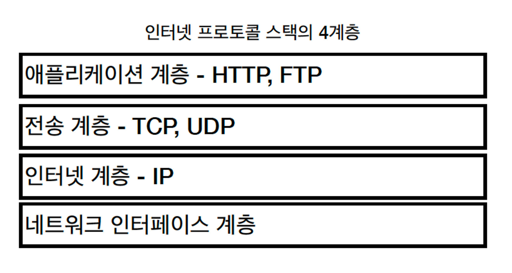
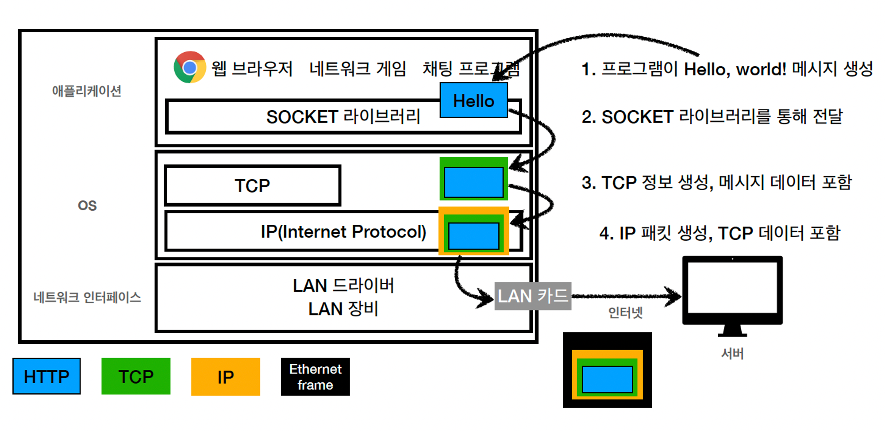
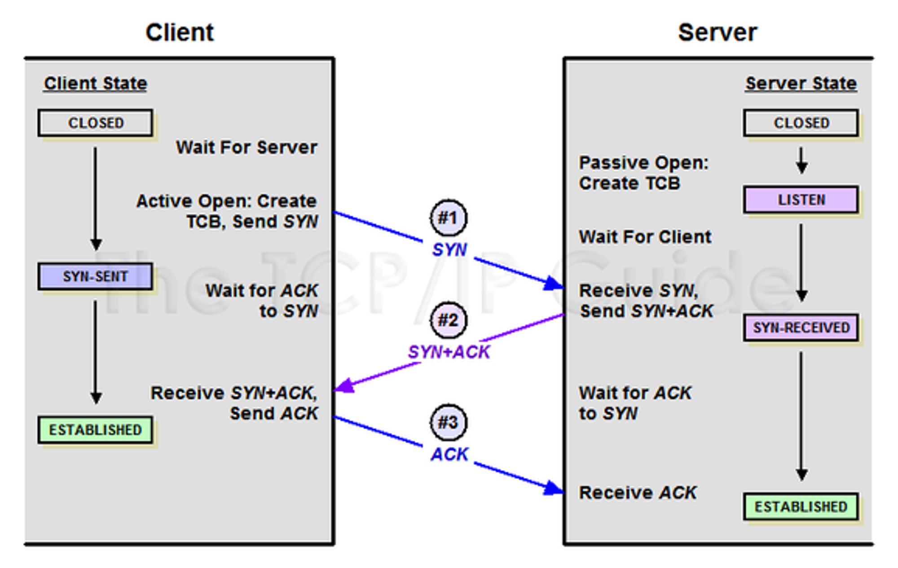
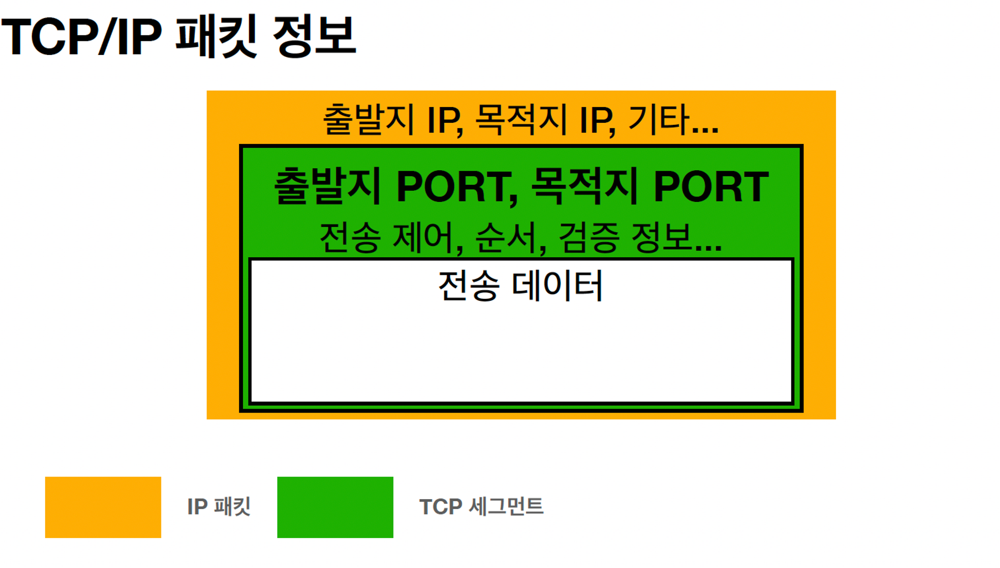
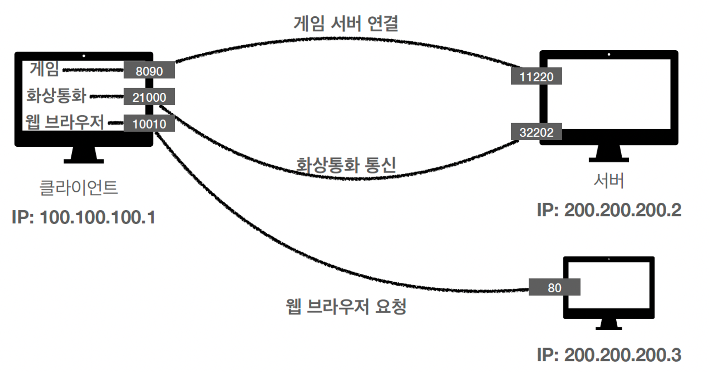
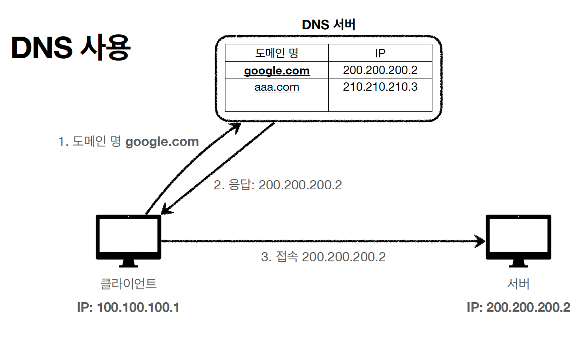

### 인터넷통신

- 데이터가 수많은 복잡한 상황을 거쳐서 목적지까지 안전하게 도착해야할 필요가 있음

### `IP (인터넷 프로토콜)`

- 역할
  - 지정한 IP 주소에 데이터 전달
  - 패킷이라는 통신 단위로 데이터 전달
- IP 프로토콜의 한계
  - 비연결성
    - 패킷을 받을 대상이 없거나 서비스 불능 상태여도 패킷 전송
    - 예시. 친구의 PC가 꺼져있음, 이사 간 친구의 집에 편지를 보냄
  - 비신뢰성
    - 중간에 패킷이 사라지면?
    - 패킷이 순서대로 안오면? (1500byte의 용량을 2개로 나눠서 보낼때, 1번을 먼저 보냈지만 2번이 더 빠른 경로로 찾아서 가다보니 2번이 먼저 도착할 수도 있음)
  - 프로그램 구분
    - 같은 IP를 사용하는 서버에서 통신하는 애플리케이션이 둘 이상이면?

### `TCP`, `UDP`

- 인터넷 프로토콜 스택의 4계층

  

  

- `패킷(packet)`? 네트워크를 통해 전송하기 쉽도록 자른 데이터의 전송 단위 (소포를 뜻하는 용어, 소화물(package) + 덩어리(bucket)의 합성어)

- `TCP / 전송 제어 프로토콜(Transmission Control Protocol)`
  - 연결지향 - TCP 3 way handshake (가상 연결)
  - 데이터 전달 보증
  - 순서 보장
  - 신뢰할 수 있는 프로토콜
  - 현재는 대부분 TCP 사용
- **`TCP 3 way handshake`**

  - TCP는 장치들 사이에 논리적인 접속을 성립(establish)하기 위하여 3-way handshake를 사용한다.
  - TCP 3-Way Handshake? TCP/IP프로토콜을 이용해서 통신을 하는 응용프로그램이 데이터를 전송하기 전에 먼저 정확한 전송을 보장하기 위해 상대방 컴퓨터와 사전에 세션을 수립하는 과정
  - TCP 접속을 성공적으로 성립하기 위하여 반드시 필요
  - 역할? 양쪽 모두 데이터를 전송할 준비가 되었다는 것을 보장하고, 실제로 데이타 전달이 시작하기전에 한쪽이 다른 쪽이 준비되었다는 것을 알수 있도록 한다.

  ```
  Client > Server : TCP
  SYNServer > Client : TCP
  SYN ACKClient > Server : TCP ACK

  SYN은 'synchronize sequence numbers', 그리고 ACK는'acknowledgment' 의 약자
  ```

  

- `UDP / 사용자 데이터그램 프로토콜(User Datagram Protocol)`
  - 하얀 도화지에 비유(기능이 거의 없음)
  - 연결지향 X - TCP 3 way handshake X
  - 데이터 전달 보증 X
  - 순서 보장 X
  - 데이터 전달 및 순서가 보장되지 않지만, 단순하고 빠름
  - 정리
    - IP와 거의 같다. +PORT +체크섬 정도만 추가 (IP로 여러 패킷이 오는데 영상인지 음악인지하는 패킷들을 구분해주는 역할을 함)
    - 애플리케이션에서 추가 작업 필요

### `PORT`

- 배가 도착하는 항구라는 의미
- 같은 IP 내에서 프로세스 구분
  - 패킷에 포트번호까지 포함되어 있어서, 도착지에 보낼 수 있음
    
    
- 포트 번호
  - 0 ~ 65535 할당 가능
    • 0 ~ 1023: 잘 알려진 포트, 사용하지 않는 것이 좋음
    • FTP - 20, 21
    • TELNET - 23
    • HTTP - 80
    • HTTPS - 443

### `DNS / 도메인 네임 시스템(Domain Name System)`

- DNS가 필요한 이유?
  - IP는 기억하기 어렵다
  - IP는 변경 될 수 있다.
- 역할?
  - 전화번호부
  - 도메인 명 → IP주소 (변환)
- 따라서, DNS가 있으면 기억하기 어려운 IP주소를 알려주고, IP가 변경되는 문제를 해결해줌

  

### 정리

- `IP`는 메세지가 잘 도착했는지 신뢰하기 어렵고, 포트라는 개념도 없고, 메세지 순서가 꼬일수 있음 → TCP가 해결해줌
- `TCP`는 물리적 연결이 아닌 논리적으로 연결되어, `TCP 3-Way Handshake` 를 통해 정확한 데이터 전달을 수행
- `UDP`는 IP랑 비슷한데 PORT만 추가되는 백지 (필요에 따라 어플리케이션에서 기능 확장할 수 있음)
- `PORT`는 같은 IP안에서 동작하고 통신하는 어플리케이션을 구분하는 역할 (IP가 아파트라면, PORT는 몇동 몇호 같은 개념)
- `DNS`가 있으면 기억하기 어려운 IP주소를 알려주고, IP주소가 변경되는 문제를 해결해줌
