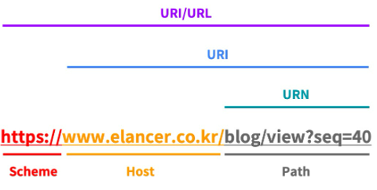
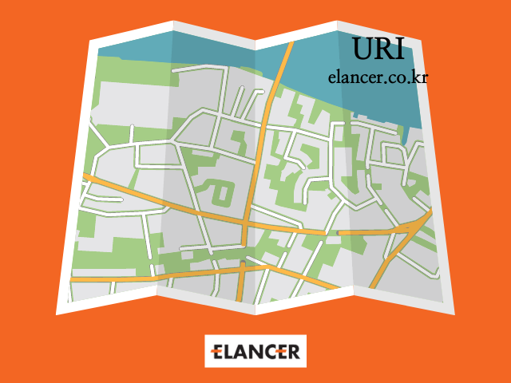
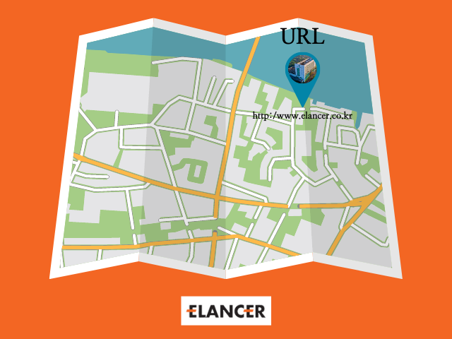
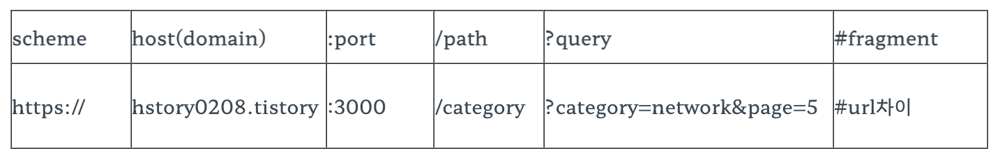
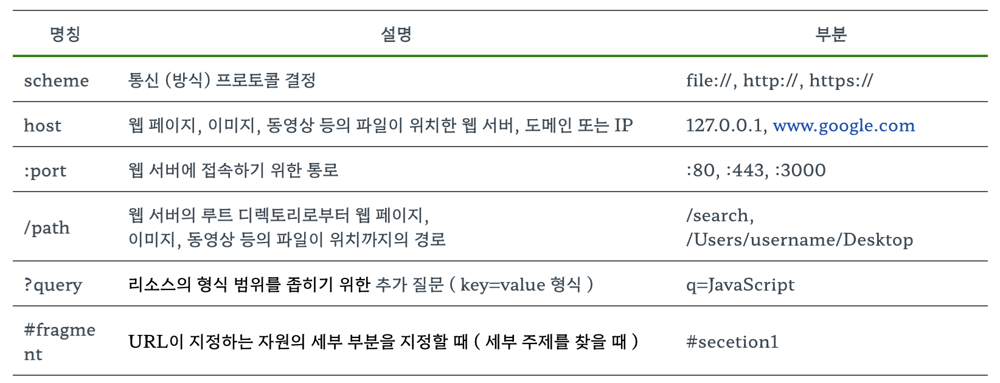
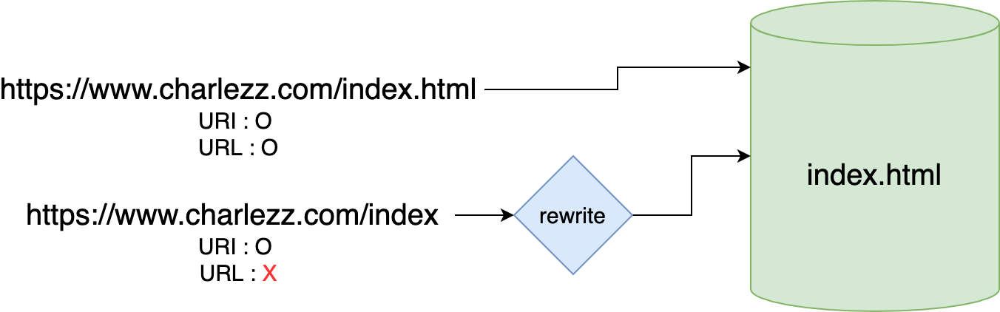
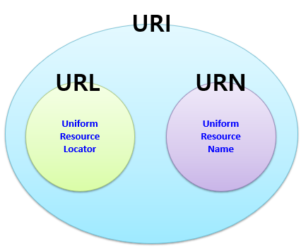
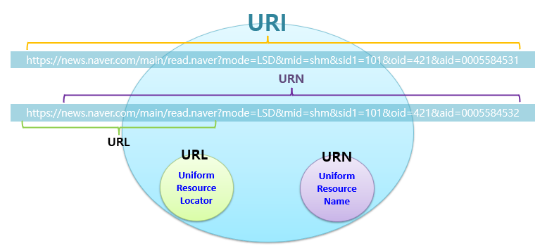

# 2장 URI와 웹 브라우저 요청 흐름

### `URI vs URL vs URN`



- Scheme: 리소스에 접근하는 데 사용할 프로토콜. 웹에서는 http 또는 https를 사용
- Host: 접근할 대상(서버)의 호스트 명
- Path: 접근할 대상(서버)의 경로에 대한 상세 정보

### `URI (Uniform Resource Identifier)` - `통합 자원 식별자`

> 인터넷에 있는 자원을 나타내는 유일한 주소.
> 인터넷에 존재하는 각종 정보들의 유일한 이름이나 위치를 표시하는 식별자이다.

- 자원의 위치뿐만 아니라 자원에 대한 고유 식별자로서 URL을 의미를 포함한다.
- URI의 존재는 인터넷에서 요구되는 기본조건으로써 인터넷 프로토콜에 항상 붙어다니며, URI의 하위 개념으로 URL,과 URN이 있습니다.

  

### `URL (Uniform Resource Locator)` - `통합 자원 지시자`

> 웹주소이다.
> 컴퓨터 네트워크 상에서 리소스가 어디있는지 알려주기 위한 규약이다.

- 특정 웹 페이지의 주소에 접속하기 위해서는 웹 사이트의 주소뿐만 아니라 프로토콜(https, http, sftp, smp 등)을 함께 알아야 접속이 가능한데, 이들을 모두 나타낸는 것이 URL이다.
- 즉, Resource의 정확한 위치 정보(파일의 위치)를 나타내고, URL을 통해서 Resource가 어디에 있는지 어떻게 접근할 수 있는 지 알 수 있다.

  

- 예시
  - https://www.naver.com/ - 네이버의 URL
  - https://search.shopping.naver.com/best/today?rankedDate=20220922 - 네이버 쇼핑의 오늘의 베스트 카테고리 URL
  - https://www.youtube.com/feed/subscriptions - 유튜브의 구독한 목록 URL
- 구조

  ```
  https://hstory0208.tistory:3000/category?category=network&page=5#url차이
  ```

  
  

### `URN (Uniform Resource Name)` - `통합 자원 이름`

- URN은 리소스의 위치, 프로토콜, 호스트 등과는 상관없이 각 자원에 이름을 부여한 것. 즉, URL은 어떤 특정 서버에 있는 웹 문서를 가리키는 반면, URN은 웹 문서의 물리적인 위치와 상관없이 웹 문서 자체를 나타낸다
- 개별 자원에 식별자를 부여하게 되면 해당 정보에 대한 URN은 일정하게 유지되며 리소스의 위치, 프로토콜, 호스트와 관계없이 위치를 파악할 수 있다는 장점이 있다.
- 예를 들어, 웹 문서가 다른 웹 서버로 이동하거나 주소가 바뀌는 등 물리적 위치가 변경되더라도 해당 문서를 찾는 것 가능.

### URI vs URL (비교)

> URI는 식별하고, URL은 위치를 가르킴

  

- 두 주소는 모두 index.html을 가리키고 있다.
- 첫번째 주소는 웹서버의 실제 파일 위치를 나타내는 주소이므로 URI이면서 URL이다.
- 두번째 주소는 실제로 index라는 파일이 웹서버에 존재하지 않으므로 URL은 아니다. 하지만 서버 내부에서 이를 처리하여 결국 index.html을 가리키기 때문에 URI라고 볼 수 있다.

### URI Vs URL (차이점)

- URL은 일종의 URI이다.

  - “URL은 URI이지만, 모든 URI가 URL인 것은 아니다.”
  - 즉, URI가 더 포괄적인 개념이며 URL은 이 안에 포함됩니다.

  
  

- URL은 프로토콜과 결합한 형태이다.

  > https://www.elancer.co.kr > URL

  - 어떻게 위치를 찾고 도달할 수 있는지까지 포함되어야 하기 때문에 URL은 프로토콜 + 이름(또는 번호)의 형태여야만 합니다. (프로토콜(protocol)이란, 리소스에 접근하는 방법을 지정하는 방식입니다. 일반적으로 https, http, ftp 또는 file 등이 여기에 해당할 수 있습니다.)

- URI는 그 자체로 이름이 될 수 있다.

  > elancer.co.kr > URI
  > https://www.elancer.co.kr > URL, URI

  - URI는 그 자체로 이름(elancer.co.kr)이거나,
  - 이름 + 위치(https://www.elancer.co.kr)를 나타낸 형태 모두가 해당합니다. (식별자+위치를 나타내는 URL은 URI의 일종이기 때문)
