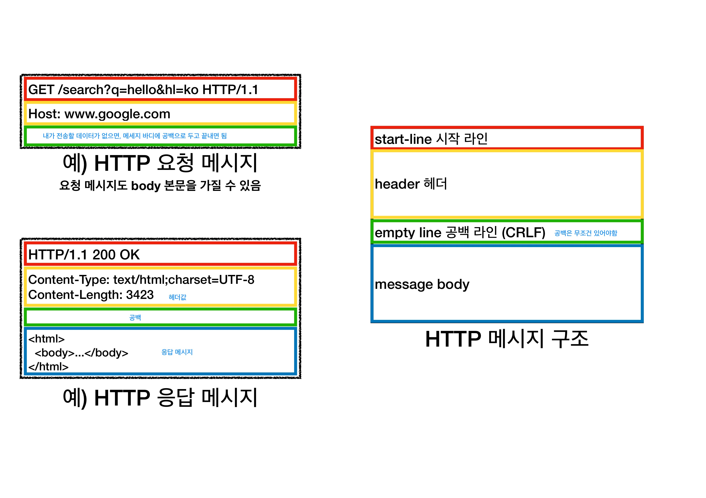

# 3장 HTTP (Hyper Text Transfer Protocol)

### HTTP 메시지에 모든 것을 전송 ⇒ 지금은 HTTP 시대!

- HTML, TEXT
- IMAGE, 음성, 영상, 파일
- JSON, XML (API)
- 거의 모든 형태의 데이터 전송 가능
- 서버간에 데이터를 주고 받을 때도 대부분 HTTP 사용

### HTTP 역사

- HTTP/0.9 1991년: GET 메서드만 지원, HTTP 헤더X
- HTTP/1.0 1996년: 메서드, 헤더 추가
- HTTP/1.1 1997년: 가장 많이 사용 → 우리에게 가장 중요한 버전
  - RFC2068 (1997) -> RFC2616 (1999) -> RFC7230~7235 (2014)
- HTTP/2 2015년: 성능 개선
- HTTP/3 진행중: TCP 대신에 UDP 사용, 성능 개선

### 기반 프로토콜

- TCP : HTTP/1.1, HTTP/2
- UDP : HTTP

⇒ 현재 HTTP1.1 주로 사용 → HTTP/2, HTTP/3 도 점점 증가

### HTTP 특징

- 클라이언트 서버 구조
  - Request Response 구조
  - 클라이언트는 서버에 요청을 보내고, 응답을 대기
  - 서버가 요청에 대한 결과를 만들어서 응답
    
  - TMI
    - 예전에는 한곳에서 클라이언트 + 서버가 함께 있었음.
    - 지금은 분리된 상태
    - client: 복잡한 비즈니스도 없고, 복잡한 데이터를 다룰 필요없이 사용자 UI에 집중
    - server: 비즈니스 로직, 데이터를 담음
    - 분리했을때 장점 : 독립적으로 진화가 가능
    - ex. 트래픽이 100배 폭주하면? client는 손댈필요 없음. server의 아키텍처를 어떤식으로 할지, 대용량 트래픽을 어떻게 고도화할지 고민하기(PHP → Java, 다른 언어를 사용한다던지)

### `무상태 프로토콜 (stateless)`

- server가 client의 상태를 보존X
- 장점: server 확장성 높음 (스케일 아웃)
- 단점: client가 추가 데이터 전송

### Stateful vs Stateless 차이

- `Stateful (상태유지)`

  - server가 client의 이전상태를 보존
  - ex. 중간에 점원이 바뀌면? 장애발생 (점원이 바뀌면 문맥이 사라짐)
  - ⇒ 중간에 다른 점원으로 바뀌면 안된다. (중간에 다른 점원으로 바뀔 때 상태 정보를 다른 점원에게 미리 알려줘야 한다.)

    

    

- `Stateless (무상태)`

  - ex. 중간에 점원이 바뀌면? 그때그때 필요한 데이터를 점원에게 넘김 (확장성, 무한 증식 가능) → 중간에 점원이 바뀌어도 문제 없음. 갑자기 고객이 증가해도 점원을 대거 투입할 수 있다.
  - 갑자기 클라이언트 요청이 증가해도 서버를 대거 투입할 수 있다. ⇒ 무상태는 응답 서버를 쉽게 바꿀수 있다. → 무한한 서버 증설 가능 (상태유지를 안하기 때문에 서버 증설하고 아무데나 들어오면 됨)
  - 상태를 보관하지 않고, 필요하면 응답만 하면 됨
  - 중간에 서버가 장애나면? clientA는 중계서버가 있기때문에, 중계서버가 서버 2로 던짐.
  - (클라이언트가 필요한 정보를 다 보내니까 아무 정보가 필요하지 않음)
  - `scale out`? 서버를 옆으로 쫙 늘림 (수평확장) → 큰 이벤트를 하면 백앤드는 장비를 수백로 확 늘릴수 있음

    

    

    

### Stateless (실무한계)

- 결론: 웹 어플리케이션 설계할때는 최대한 무상태로 설계하고, 어쩔수 없는 경우에 한해서 상태유지를 한다.
- 모든것을 무상태로 설계 할 수 있는 경우도 있고 없는 경우도 있다
- 무상태 예)로그인이 필요없는 단순한 서비스 소개화면 (상태 유지할 필요X)
- 상태 유지 예) 로그인(로그인한 사용자의 경우 로그인 했다는 상태를 서버에 유지)
- 일반적으로 브라우저 쿠키와 서버 세션등을 사용해서 상태 유지 (브라우저에서 쿠키와 서버에 세션을 같이 조합해서 상태 유지)
- 상태 유지는 최소한만 사용
- 데이터를 너무 많이 보내는 단점

### `비연결성 (connectionless)`

- HTTP는 기본이 연결을 유지하지 않는 모델
- 일반적으로 초 단위의 이하의 빠른 속도로 응답
- 1시간 동안 수천명이 서비스를 사용해도 실제 서버에서 동시에 처리하는 요청은 수십개 이 하로 매우 작음
  - ex. 웹 브라우저에서 계속 연속해서 검색 버튼을 누르지는 않는다. (검색하고 한참 보고, 검색하고 한참 보고)
- 서버 자원을 매우 효율적으로 사용할 수 있음 (HTML 문서를 서로 주고 받는 환경에서는 서버 자원의 가용성을 높일 수 있음)

### 비연결성 한계와 극복

- TCP/IP 연결을 새로 맺어야 함 - 3 way handshake 시간 추가
- 웹 브라우저로 사이트를 요청하면 HTML 뿐만 아니라 자바스크립트, css, 추가 이미지 등 수 많은 자원이 함께 다운로드
- 지금은 HTTP 지속 연결(Persistent Connections)로 문제 해결
- HTTP/2, HTTP/3에서 더 많은 최적화
- 초기의 HTTP vs 지금의 HTTP 비교

  

  

- 연결을 유지하는 모델

  - 단점 : 클라이언트 2,3이 놀고 있어도 계혹 서버가 연결을 유지

  

- 연결을 유지하지 않는 모델

  - 연결을 주고 받을때만 연결을 유지
  - 필요한 것만 주고 받고나면 연결을 즉시 끝냄
  - 최소한의 자원 유지

  

### 무상태(stateless)를 기억하자

- 무상태로 갈 수 있는 것은 최대한 무상태로 가고, 어쩔수 없는 것에 한해서만 상태유지를 하도록 잘 분리해서 설계하자.
- 서버 개발자들이 어려워하는 업무
  - 정말 같은 시간에 딱 맞추어 발생하는 대용량 트래픽
  - ex. 선착순 이벤트, 명절 KTX 예약, 학과 수업 등록
  - ex. 저녁 6:00 선착순 1000명 치킨 할인 이벤트 -> 수만명 동시 요청

### HTTP 메시지 (수신, 발신) → `시작라인`, `헤더`, `바디`로 나뉨

- HTTP 요청 메시지와 응답 메시지의 구조가 다름

  

### 시작라인(start-line) - 요청메시지

  

- `request-line` = method SP(공백) request-target SP HTTP-version CRLF(엔터)
- HTTP 메서드 (GET: 조회)
- 요청대상(/search?q=hello&hl=ko)
- HTTP Version

- 요청 메시지 - HTTP 메서드
  - 종류: GET, POST, PUT, DELETE…
  - 서버가 수행해야 할 동작 지정
    - GET: 서버를 통한 리소스 조회
    - POST: 요청 내역 처리
- 요청 메시지 - 요청 대상

  - absolute-path[?query] (절대경로[?쿼리])
  - 절대경로= "/" 로 시작하는 경로 (우리는 절대 경로로 시작하다 정도로만 이해 필요)
  - 참고: \*, http://...?x=y 와 같이 다른 유형의 경로지정 방법도 있다.

- 요청 메시지 - HTTP 버전

### 시작라인(start-line) - 요청메시지

  

- `status-line` = 시작라인(start-line) - 요청메시지
- HTTP 버전
  - HTTP 상태 코드: 요청 성공, 실패를 나타냄
    - 200: 성공
    - 400: 클라이언트 요청 오류
    - 500: 서버 내부 오류
  - 이유문구:사람이이해할수있는짧은상태코드설명글

### HTTP 헤더

- header-field = field-name ":" OWS field-value OWS (OWS: 띄어쓰기 허용)
- field-name은 대소문자 구분 없음

    

- 용도
  - HTTP 전송에 필요한 모든 부가정보
  - ex. 메시지 바디의 내용, 메시지 바디의 크기, 압축, 인증, 요청 클라이언트(브라우저) 정보, 서버 애플리케이션 정보, 캐시 관리 정보..
  - 표준 헤더가 너무 많음

### HTTP 메시지 바디

  

- 용도
  - 실제 전송할 데이터
  - HTML 문서, 이미지, 영상, JSON 등등 byte로 표현할 수 있는 모든 데이터 전송 가능

### HTTP의 단순함 + 확장 가능

- 크게 성공하는 표준 기술은 단순하지만 확장 가능한 기술

### 지금은 HTTP 시대
