# 4장 HTTP 메서드

### API URI(Uniform Resource Identifier) 설계

- 중요한것은 리소스 식별 (→ 리소스를 기준으로 설계 진행)

### API URI 고민

- 리소스의 의미는 뭘까?
  - 회원을 등록하고 수정하고 조회하는게 리소스가 아니다!
  - ex. 미네랄을 캐라 -> 미네랄이 리소스
  - **회원이라는 개념 자체가 바로 리소스다.**
- 리소스를 어떻게 식별하는게 좋을까?
  - 회원을 등록하고 수정하고 조회하는 것을 모두 배제
  - **회원이라는 리소스만 식별하면 된다. -> 회원 리소스를 URI에 매핑**
  -

### **리소스와 행위을 분리 → 가장 중요한 것은 리소스를 식별하는 것**

- **URI는 리소스만 식별!**
- **리소스**와 해당 리소스를 대상으로 하는 **행위**을 분리
  - 리소스: 회원
  - 행위: 조회, 등록, 삭제, 변경
- 리소스는 명사, 행위는 동사 (미네랄을 캐라)
- 행위(메서드)는 어떻게 구분?

⇒ 리소스만 식별하자. HTTP 메서드인 GET, POST, PUT, DELETE가 조회, 등록, 변경 삭제 등의 역할을 해줄것이다

### **HTTP 메서드 종류 주요 메서드**

- GET: 리소스 조회
- POST: 요청 데이터 처리, 주로 등록에 사용
- PUT: 기존의 리소스를 대체, 해당 리소스가 없으면 생성
- PATCH: 리소스 부분 변경
- DELETE: 리소스 삭제

### **HTTP 메서드 종류 기타 메서드**

- **HEAD:** GET과 동일하지만 메시지 부분을 제외하고, 상태 줄과 헤더만 반환
- **OPTIONS:** 대상 리소스에 대한 통신 가능 옵션(메서드)을 설명(주로 CORS에서 사용)
- **CONNECT:** 대상 리소스로 식별되는 서버에 대한 터널을 설정
- **TRACE:** 대상 리소스에 대한 경로를 따라 메시지 루프백 테스트를 수행

### **HTTP 메서드 - `GET`**

- 리소스 조회
- 서버에 전달하고 싶은 데이터는 query(쿼리 파라미터, 쿼리 스트링)를 통해서 전달
- 메시지 바디를 사용해서 데이터를 전달할 수 있지만, 지원하지 않는 곳이 많아서 권장하지
  않음

    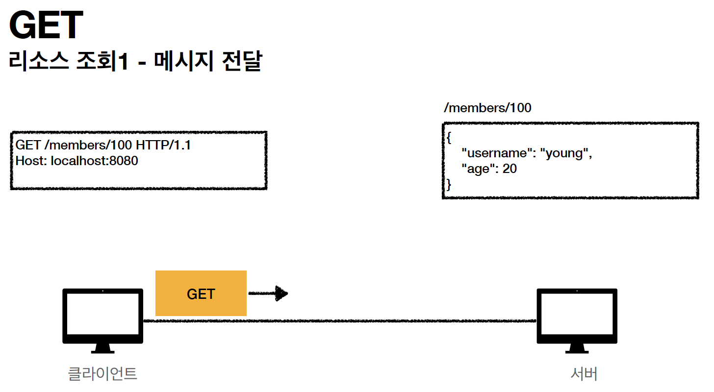

    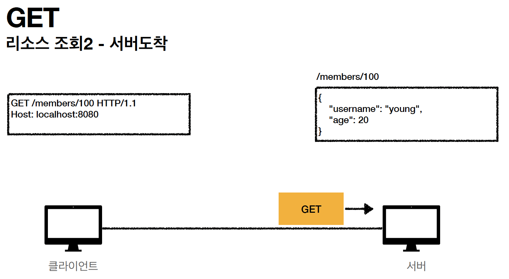

    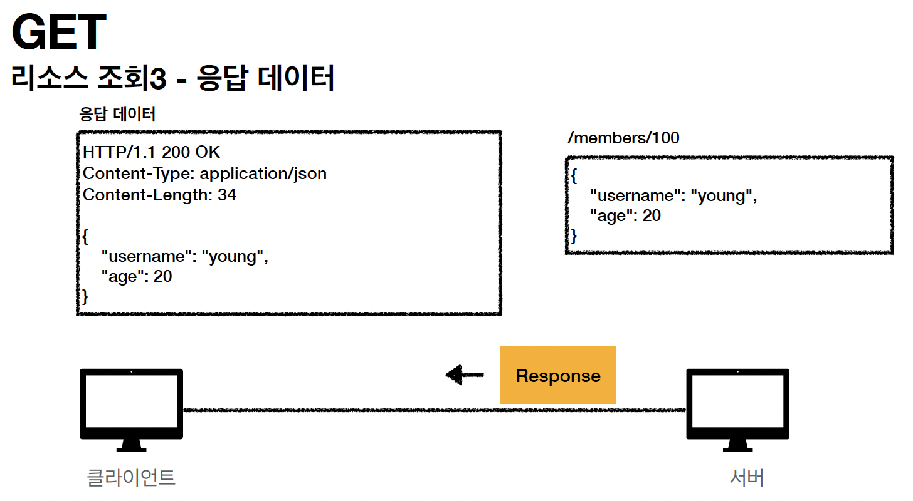

### **HTTP 메서드 - `POST`**

- 요청 데이터 처리
- **메시지 바디를 통해 서버로 요청 데이터 전달**
- 서버는 요청 데이터를 **처리**
  - 메시지 바디를 통해 들어온 데이터를 처리하는 모든 기능을 수행한다.
- 주로 전달된 데이터로 신규 리소스 등록, 프로세스 처리에 사용

    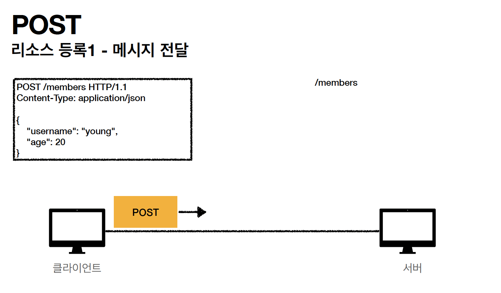

    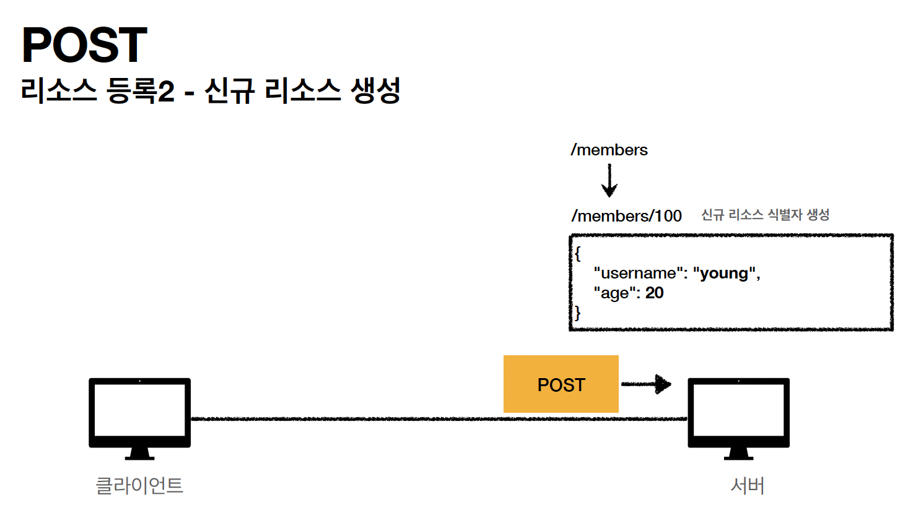

    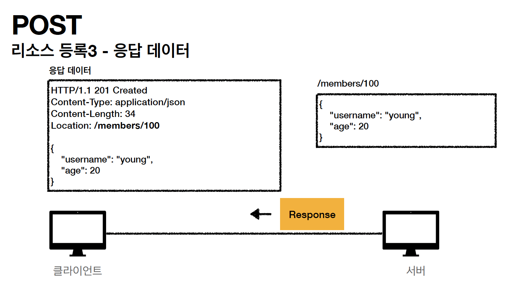

- **요청 데이터를 어떻게 처리한다는 뜻일까? 예시**
  - 스펙: POST 메서드는 **대상 리소스가 리소스의 고유 한 의미 체계에 따라 요청에 포함 된 표현을 처리하도록 요청**합니다. (구글 번역)
  - 예를 들어 POST는 다음과 같은 기능에 사용됩니다.
    - HTML 양식에 입력 된 필드와 같은 데이터 블록을 데이터 처리 프로세스에 제공
      - 예) HTML FORM에 입력한 정보로 회원 가입, 주문 등에서 사용
    - 게시판, 뉴스 그룹, 메일링 리스트, 블로그 또는 유사한 기사 그룹에 메시지 게시
      - 예) 게시판 글쓰기, 댓글 달기 (내가 쓴 글이 서버로 넘어가고, 서버가 게시판에 내가 쓴 글을 저장해줌)
    - 서버가 아직 식별하지 않은 새 리소스 생성
      - 예) 신규 주문 생성
    - 기존 자원에 데이터 추가
      - 예) 한 문서 끝에 내용 추가하기
  - **정리: 이 리소스 URI에 POST 요청이 오면 요청 데이터를 어떻게 처리할지 리소스마다 따로 정해야 함 → 정해진 것이 없음**

### `POST` 정리

- **1. 새 리소스 생성(등록)**
  - 서버가 아직 식별하지 않은 새 리소스 생성
- **2. 요청 데이터 처리**
  - 단순히 데이터를 생성하거나, 변경하는 것을 넘어서 프로세스를 처리해야 하는 경우
    - ex. 주문에서 결제완료 -> 배달시작 -> 배달완료 처럼 단순히 값 변경을 넘어 프로세스의 상태가 변경되는 경우
  - POST의 결과로 새로운 리소스가 생성되지 않을 수도 있음
    - ex. POST /orders/{orderId}/start-delivery (**컨트롤 URI**)
- **3. 다른 메서드로 처리하기 애매한 경우**
  - ex. JSON으로 조회 데이터를 넘겨야 하는데, GET 메서드를 사용하기 어려운 경우
  - 애매하면 POST (POST는 메시지를 담는 모든것을 할 수 있음. but, 조회할때는 GET을 쓰는것이 유리. GET으로 오면 캐싱하기로 약속했지만, POST는 아님. ⇒ 조회는 최대한 GET을 쓰고, 그 외 데이터(변경, 프로세스 진행 등)의 어쩔수 없는 경우에는 POST를 쓰자)

### **HTTP 메서드 - `PUT`**

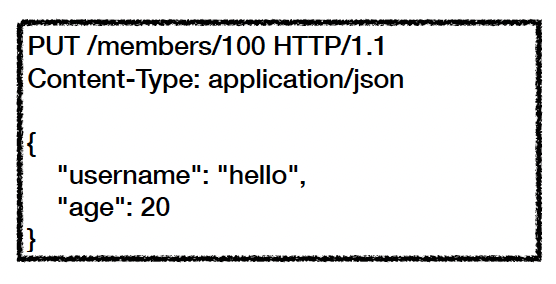

- **리소스를 대체**
  - 리소스가 있으면 완전히!!!! 대체 (= 덮어쓰기)
  - 리소스가 없으면 생성
  - 쉽게 이야기해서 덮어버림
- **중요! 클라이언트가 리소스를 식별**

  - 클라이언트가 리소스 위치를 알고 URI 지정
  - POST와 차이점

    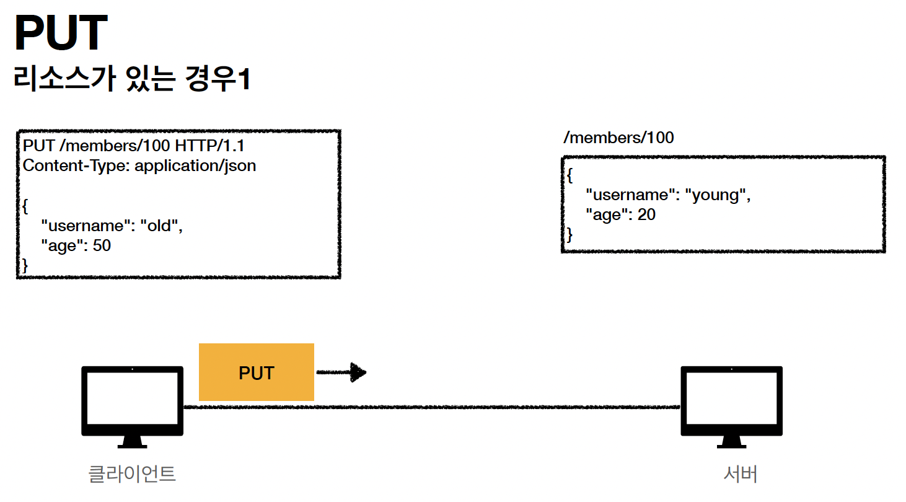
        
    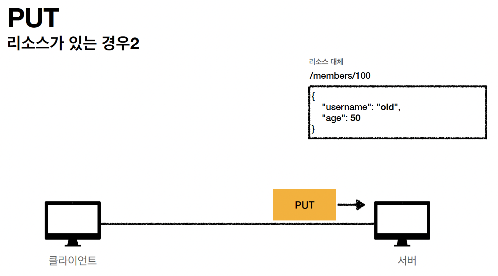
        
    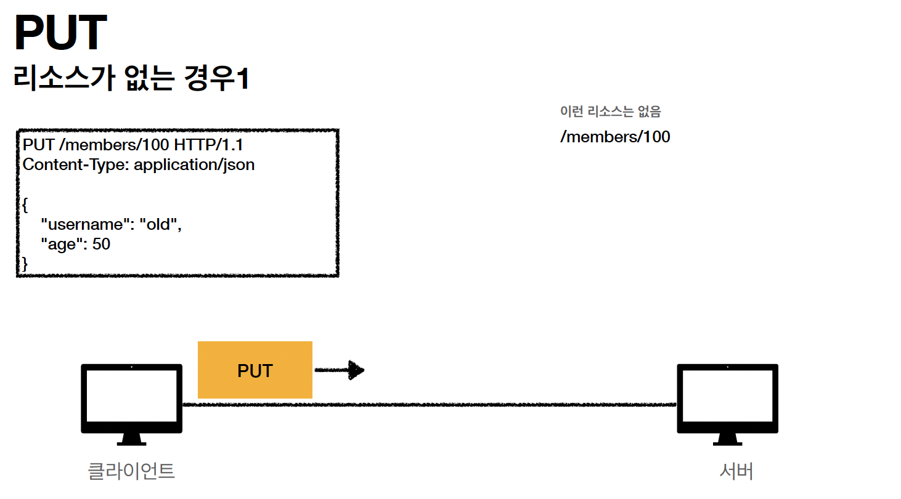
        
    
        
    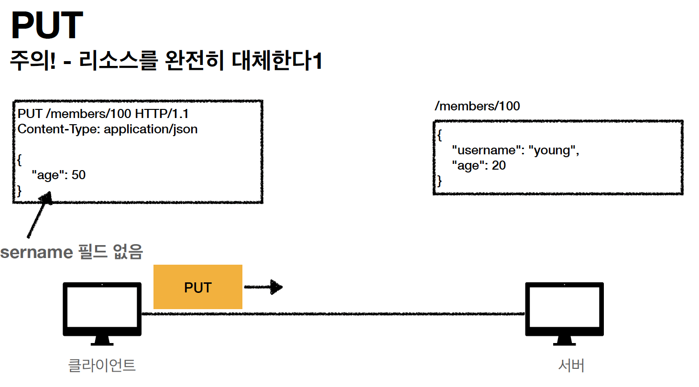
        
    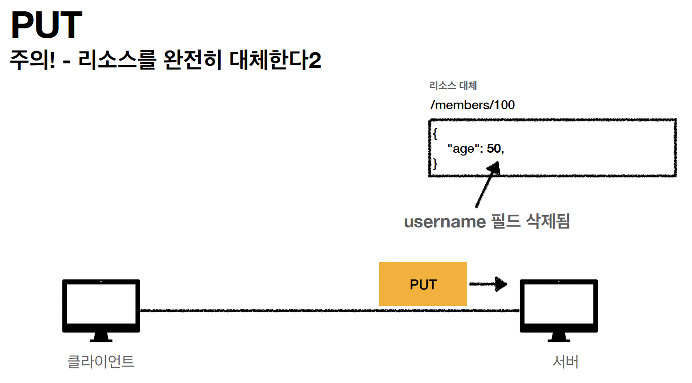

### **HTTP 메서드 - `PATCH`**

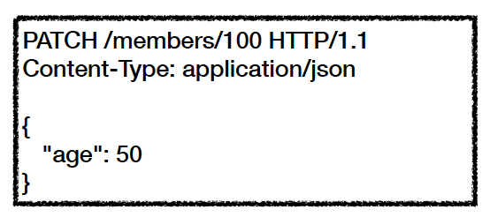

- 리소스 부분 변경
- 간혹 PATCH가 지원이 안되는 서버가 있는데 → 무적의 POST를 쓰자

    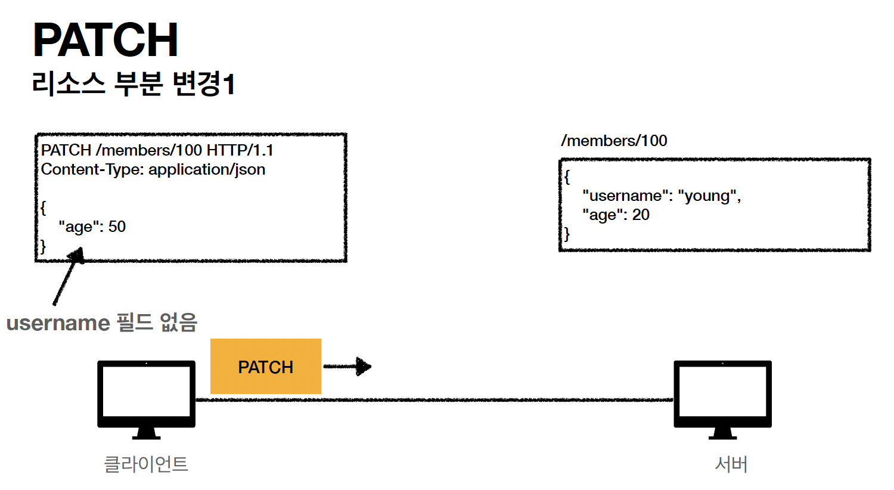

    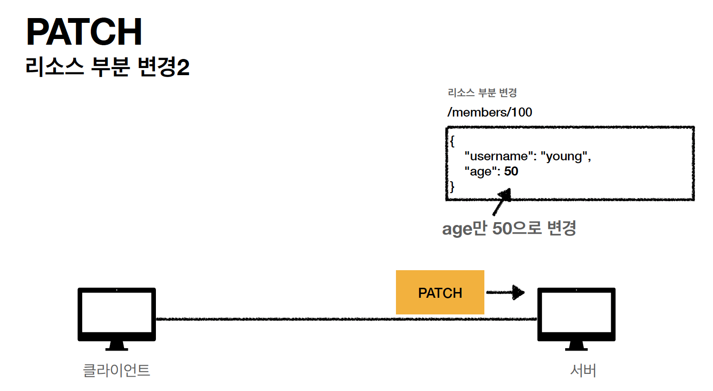

### **HTTP 메서드 - `DELETE`**

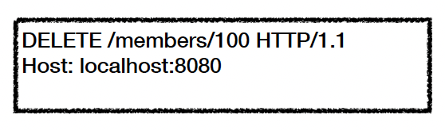

- 리소스 제거

    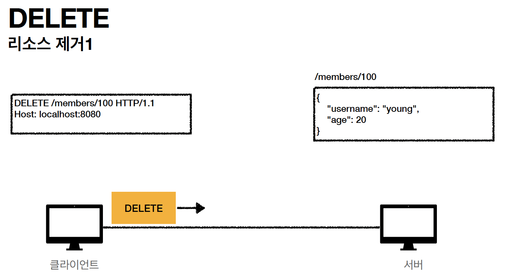

    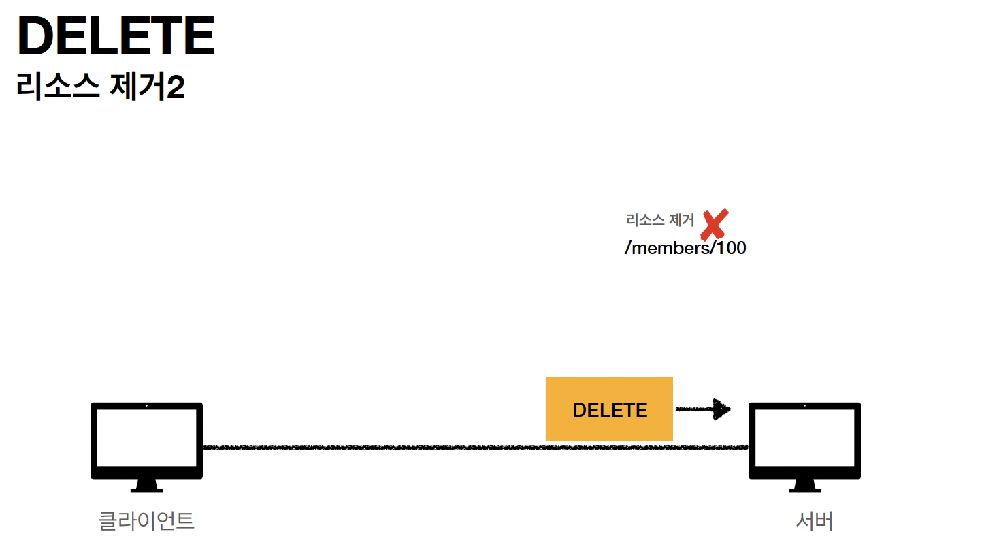

### **HTTP 메서드의 속성**

- `안전(Safe Methods)`
  - 호출해도 리소스를 변경하지 않는다.
  - Q: 그래도 계속 호출해서, 로그 같은게 쌓여서 장애가 발생하면요?
  - A: 안전은 해당 리소스만 고려한다. 그런 부분까지 고려하지 않는다. (해당 리소스가 변하냐 변하지 않느냐만 고려)
  - GET은 조회만 하는 것이라 안전/ DELETE, POST, PUT 등은 여러번 호출 했을때 변경이 일어나기때문에 안전하지 X
  -
- `멱등(Idempotent Methods)`
  - f(f(x)) = f(x) •
  - 한 번 호출하든 두 번 호출하든 100번 호출하든 결과가 똑같다.
  - 멱등 메서드
    - **GET**: 한 번 조회하든, 두 번 조회하든 같은 결과가 조회된다.
    - **PUT**: 결과를 대체한다. 따라서 같은 요청을 여러번 해도 최종 결과는 같다.
    - **DELETE**: 결과를 삭제한다. 같은 요청을 여러번 해도 삭제된 결과는 똑같다.
    - **POST**: 멱등이 아니다! 두 번 호출하면 같은 결제가 중복해서 발생할 수 있다.
      ex. 두번 결제하면 중복결제됨. 사장님이 배송을 2번 눌러도 문제가 됨
  - 활용
    - 자동 복구 메커니즘
    - 서버가 TIMEOUT 등으로 정상 응답을 못주었을 때, 클라이언트가 같은 요청을 다시 해
      도 되는가? 판단 근거
  - **Q: 재요청 중간에 다른 곳에서 리소스를 변경해버리면?**
    - 사용자1: GET -> username:A, age:20
    - 사용자2: PUT -> username:A, age:30
    - 사용자1: GET -> username:A, age:30 -> 사용자2의 영향으로 바뀐 데이터 조회
  - **A: 멱등은 외부 요인으로 중간에 리소스가 변경되는 것 까지는 고려하지는 않는다.**
    ⇒ 동일한 사용자가 똑같은 요청을 여러번 한것에 대해서만 고려한다.
- `캐시가능(Cacheable Methods)`
  - 응답 결과 리소스를 캐시해서 사용해도 되는가?
  - GET, HEAD, POST, PATCH 캐시가능
  - 실제로는 GET, HEAD 정도만 캐시로 사용
    - POST, PATCH는 본문 내용까지 캐시 키로 고려해야 하는데, 구현이 쉽지 않음
