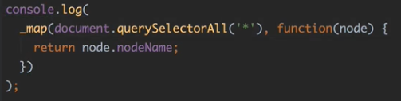
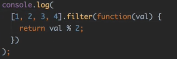

# 2장 함수형으로 전환하기

### 다형성

- 이미 array에는 map과 filter가 있음
- map과 filter 같은 함수들은 이미 JavaScript에 있는데 굳이 이미 있는 함수를 만든 이유는?
  - 정확히는 함수가 아닌 method이기 때문
  - 즉, 순수함수가 아닌 `method`는 객체의 상태에 따라 결과가 달라지는 `객체지향 프로그래밍`
- method의 특징?
  - 해당 클래스에 정의되기 때문에 해당 클래스의 인스턴스에서만 사용할 수 있음
  - 즉, map이라는 함수는 arrary가 아니면 사용이 어려움
  - 다시말해, map과 filter는 array에서 사용하기 위해 만든것
  - 같은 맥락으로, JavaScript에는 array가 아닌데 array처럼 여겨지는 객체들이 많음
  - [예시] array-like 객체로 jQuary객체(element를 찾았을때 리턴된 객체를 많이 사용했을텐데 array가 아님 (오해하는 경우 많음) ⇒ jQuary는 array가 아닌 array-like 객체
    ⇒ 해당하는 클래스에 준비되어 있지 않은 메서드는 사용 불가 (다형성을 지원하기 어려움)
- 함수형 프로그래밍(함수가 기준이 되는 프로그래밍 방법)?
  - 함수를 먼저 만들고 그 함수에 맞는 데이터를 구성해서 함수에게 적용하는 식으로 프로그래밍함
  - 다형성 good (array가 아님에도 map함수로 변경하기만 하면 코드는 동작함)
  - map함수는 들어오는 인자가 length가 있고 그것이 숫자여서 0부터 돌았을 때 해당하는 키마다 값이 있으면 사용이 가능
  - array-like? 배열이 아닌 값이어도 length가 있고, length에 맞는 0부터 length보다 하나 작은 크기만큼의 값들이 담겨져 있는 키밸류상의 객체라면 array-like고, array-like면 저희가 만든 이 map과 each와 filter에서는 모두 동작 가능
- 함수가 먼저 나오는 프로그래밍 (데이터가 있기 전부터 함수가 있게 됨)

  - 데이터가 생기지 않더라도 함수 자체가 먼저 존재함 → 평가시점이 상대적으로 유연함

  

- 데이터가 먼저 나오는 프로그래밍 (데이터가 있어야 method가 생김)

  - 객체지향 프로그래밍은 평가의 순서가 중요 → 객체가 생겨야 기능을 수행할 수 있음

  

- 순수함수로 만드는 기법이 method보다 다형성과 실용성이 더 good

- 보조함수? 외부의 다양성은 array나 array-like argument 객체 같은 것들을 다 돌림직한 모든 객체들을 다 돌릴 수 있도록 하는 것은 이 고차함수의 구조, 맵이 어떻게 구현되었느냐에 따라서 결정됨
  - 그 순수함수로 만들었고 어레이 라이크면은 다 돌릴 수 있게 다양성 높게 만든 기법은 이제 맵이나 이치나 필터가 담당하지만
  - 그 배열 안에 어떤 값이든 들어 있어도 다 뭔가 수행할 수 있게 만드는 그 역할은 이 보조함수가 하는 겁니다.
    ⇒ 내부값에 대한 다형성은 이 predicate나 iterate나 mapper 같은 이런 보조함수가 책임을 진다
