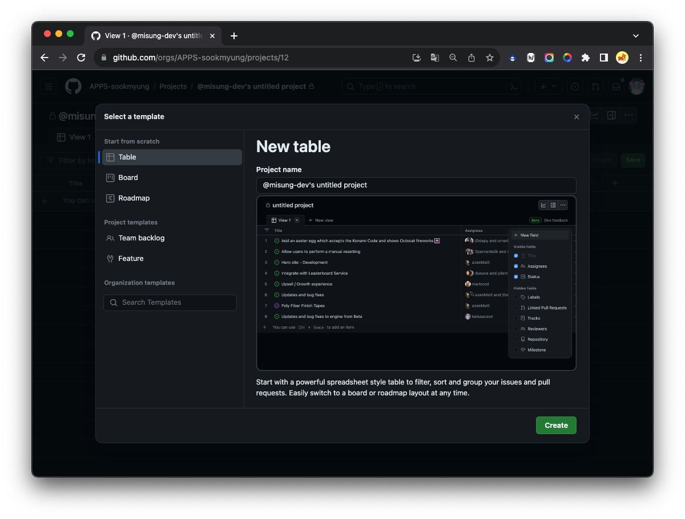
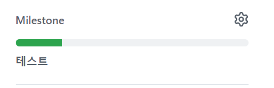

# Github의 `Projects`와 `Issue`

- update: 2023.11.17

 

# `Projects`

> 프로젝트는 작업 현황과 진행도를 볼 수 있는 메뉴이다. 이슈, PR(풀 리퀘스트)들을 하나의 작업(task)으로 구분해 그 작업이 현재 어느 정도 진행되었는지 확인할 수 있다.

- 아래와 같은 기능을 제공하고 이를 통해 프로젝트의 진행상황을 한번에 파악하기가 수월하다는 장점이 있다.

  - To Do : 해야 할 작업
  - In Progress : 진행 중인 작업
  - Done : 완료된 작업

- 프로젝트에서 일어나는 모든 일을 추적할 수 있고, 마지막으로 본 이후에 어떤 일이 생겼는지 확인할 수 있다.

### `Projects` 주요기능

- 원하는 template 선택

  - Table

    

  - Board

    

  - Roadmap

    

- 프로젝트 추가하기

  
  

- 다양한 형태의 view

  
  
  

### `Projects` 레퍼런스 (출처: 2023-POCHAK-server)

  

# `Issue`

> 이슈는 작업의 버그 수정, 새로운 추가될 기능, 개선해야하는 기능 등등 모든 것이 될 수 있다. 모든 활동 내역에 대해 이슈를 등록하고 그 이슈를 기반으로 작업을 진행한다. 그리고 이슈를 만들면 이슈를 열었다(open)라고 하고, 작업이 끝나 이슈를 정리하면 이슈를 닫았다(close)라고 말한다.

- 이슈에는 디버깅, 특정 기능의 개발, 풀 리퀘스트, 도큐먼트 쓰기 등 우리가 다루는 모든 것들이 해당된다.

- 필요성? 잦은 커뮤니케이션으로 이러한 문제를 해결할 수 있지만, 우리가 커뮤니케이션을 못하는 상황이 나올 수 있기도 하고 커뮤니케이션을 잊어버리기도 한다. 이럴 때 사용하는 것이 issue이다. 내가 어떠한 상황, 문제, 또는 플랜에 대해서 개발을 할 예정이라는 것을 알려주는 `이정표`인 것이다.

### `Issue` 주요 기능

- Assignees: 담당자

  

- Labels: 해당 작업의 유형 (참고: Label 항목에서 bug 등 기본항목을 전부 지우는 게 가능하고, 취향대로 커스터마이징이 가능하다.)

  

- Projects : 연결할 project (진행도를 한번에 볼 수 있는 메뉴)

  

- Milestone : 프로젝트가 도달해야하는 목표지점

  

  - Milestone을 사용하면, 한 가지의 목표에 여러 이슈가 등록되어 있을 때 해당 목표의 진행도가 얼마나 되는지 게이지 바 형태로 볼 수 있다. (위 이미지에서 [테스트] 를 선택했을 때)

    

### `Issue` 레퍼런스 (출처: 2023-POCHAK-server)

  

  

### 참고자료

- [[Github] Project planning for developers](https://github.com/features/issues)
- [[개발 블로그] [Github] 협업시 프로젝트(Projects)와 이슈(Issue) 사용하기](https://devlog-wjdrbs96.tistory.com/227)
- [[개발 블로그] [Github] Issue, Project 활용](https://velog.io/@dohaeng0/GitHub-Project-Issue-%ED%99%9C%EC%9A%A9)
   
