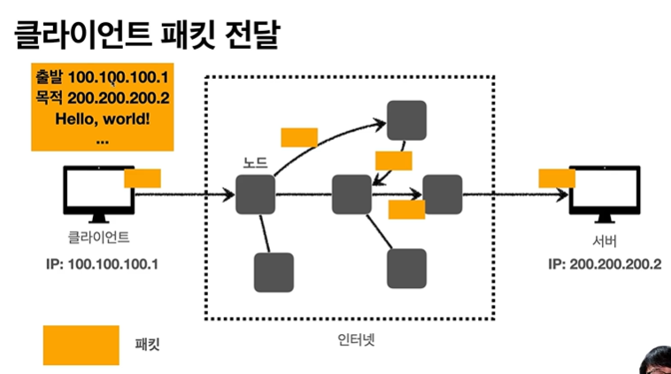
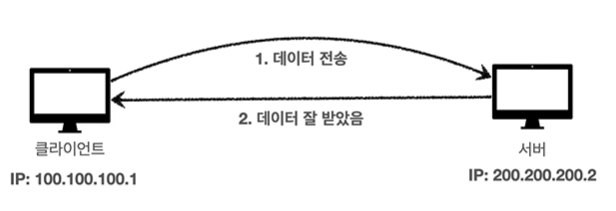

성공적인 프로그래밍
- 사용성, 성능, 확장성, 기획 변경에 대한 대응력 등이 좋다.
- 이것들을 효율적이고 생산적으로 이루는 일이 성공적인 프로그래밍이다.

함수형 프로그래밍
- 성공적인 프로그래밍을 위해 부수효과를 미워하고 (**순수함수를 만든다**) 조합성을 강조하는 프로그래밍 패러다임
- 조합성을 강조 -> 모듈화 수준을 높임
- 모듈화 수준이 높으면 생산성이 높아짐

**순수함수**: 

- 부수효과(함수가 리턴값으로 결과를 만드는 것 외에 외부상태에 영향을 끼치는 것)가 없는 함수, 수학적 함수
- ⭐들어오는 인자가 같으면 항상 동일한 결과를 리턴
    -> 보다시피 add를 console.log했을때 계속 같은 결과가 나옴
- 함수가 받은 인자 외에 다른 외부 상태에 영향을 끼치지 않음
- ⭐리턴값 외에는 외부와 소통하지 않음
- 오류를 줄이고 안정성을 높임
- 평가 시점이 중요하지 않음 (-> 함수형 프로그래밍이 중요한 이유), 조합성이 매우 뛰어남
- 평가 시점을 개발자가 조절할 수 있음. 다른 함수에 인자로 넘기거나, 다른 thread에 넣기 (안 바뀌어서 매우 안전함)

객체를 주로 다루게 되는데, 
순수함수는 객체 상태를 바꿀수 없는가
순수함수로 하는 함수형 프로그래밍은 객체를 다룰 수 없는것인가?
-> 조금 다른 방법으로 객체를 다룸
원래 있던 값은 그대로 두고, 새로운 값을 만들면서 복사해서, 원하는 값이 변형됨

**일급함수**
- JS에서는 함수가 "일급함수"이다. 
- 일급함수: 함수를 값으로 다룰 수 있음 (함수를 변수에 담을 수 있음)
- 함수를 언어에서 값으로 다룰 수 있다. 언제나 들고 다닐 수 있고 인자로 들고 다닐 수 있다. 
- 함수가 함수를 인자로 받을 수 있음

요즘 개발 이야기
재미/실시간성: 메신저, 댓글, 라이브 방송, 실시간 댓글, 협업
독창성/완성도: 애니메이션, 무한 스크롤, 벽돌(Pinterest)
더 많아져야하는 동시성: 엄청 많은 사람들을 동시에 hold해줘야함, 비동기 I/O, CSP, Actor, STM, Software transition memory
더 빨라야하는 반응성/고가용성: 절대 죽지 않는 서비스 (새벽에 점검 안됨, 새로운 기능을 넣어도 원래 서비스를 멈추지 않기), ELB, Auto Scaling(사용자가 급증하면 반응하기), OTP Supervisor
대용량/정확성/병령성: 이런 사용자는 이런 것을 좋아할 것 같다! MapReduce, Clojure Reducers
복잡도/MSA: 예전에는 하나의 프레임워크가 모든 것을 다 동작시켰는데 요즘은 세밀하게 다양한 도구들을 다뤄야 함

스멀스멀 다가오는 FP 
- 좋아지는 하드웨어 성능
- 좋아지는 컴파일러
- 함수형 프로그래밍 기술
- 좋아지는 분산/리액티브 환경
- 동시성 + 병렬성 관련 기술
- 성공적인 적용 사례와 영향

함수형 프로그래밍:
애플리케이션, 함수의 구성요소, 언어 자체를 함수처럼 여기도록 만들고,
이러한 함수 개념을 가장 우선순위에 놓는다.
문제의 해결 방법을 동사(함수)들로 구성(조합)하는 것
```js
//데이터 (객체) 기준 -> 객체지향 프로그래밍
//데이터를 먼저 디자인하고 그 데이터에 맞는 메서드를 만들어줌
duck.moveLeft();
duck.moveRight();
duck.moveLeft();
duck.moveRight();

//함수 기준 -> 함수형 프로그래밍
//함수를 만들고 그 함수에 맞게 데이터를 구성하기
moveLeft(dog);
moveRight(duck);
moveLeft({x:5, y:2});
moveRight(dog);
```

---

<style>
img{
    width:400px;
}
</style>

## 모든 개발자를 위한 HTTP 웹 기본지식
모든 것이 HTTP 기반 위에서 동작한다.
HTML, 이미지, 파일, 영상, 앱과 서버, 서버와 서버
그래서 모바일, 웹프런트, 백엔드는 모두 HTTP를 필수로 알고 있어야 함    
      
-HTTP를 사용하는 모든 기술들

그래서 HTTP를 잘 이해해야지 이 기술들을 쓸 수 있음
(이미 HTTP 알고 있다고 가정하고 기능 사용법 위주로 설명함)

- API URL을 어떻게 설계할까
- POST(새로 만들기) or PUT(수정하기)
- HTTP 상대 코드는 어떻게 할까

=> 개발자는 평생 HTTP 기반 위에서 개발하기에, 언젠가 한번은 정리해야함

1. HTTP의 전체 흐름 이해
2. 실무에 꼭 필요한 핵심 내용
3. 수많은 예시와 그림으로 설명
강의대상: HTTP 기술을 사용하는 모든 개발자 (모바일 앱, 웹 프론트엔드, 백엔드)

<u><강의 순서></u>   

인터넷 네트워크(HTTP는 TCP IP나 UCP위에서 작동함) ->    
URI와 웹 브라우저 요청 흐름 (URI? URL? URN?) ->    
HTTP의 기본 ->    
HTTP 메서드 ->    
HTTP 메서드 활용 ->    
HTTP 상태코드 ->    
HTTP 헤더 ->    
HTTP 캐쉬     

---
## 인터넷 네트워크
> 인터넷 통신 (인터넷이 어떤식으로 인터넷 상에서 통신이 일어나는지 보기)   
> IP (Internet Protocol)    
> TCP, UDP    
> PORT    
> DNS    
웹이나 HTTP 모두 인터넷 기반에서 동작을 함. 

인터넷 통신:
인터넷에서 컴퓨터 둘은 어떻게 통신할까?    
    
    
케이블로 연결되어 있으면 이런식으로 하면 됨

근데 클라이언트와 서버가 멀리에 있으면?
인터넷 망을 통해서 메세지를 보내야하는데
인터넷이 단순하지 않음 (인공위성, 해서광케이블, 등 수많은 중간 노드가 존재함)
=> 그러면 어떤 방식으로, 어떤 규칙으로, 목적지까지 안전하게 도착할까?

## IP (인터넷 프로토콜):
데이터를 인터넷 망을 통해서 전달하기 위한 최소한의 규칙
- 지정한 IP 주소 (IP Address)에 데이터 전달
- 패킷 (Packet)이라는 통신 단위로 데이터 전달    
    
1. 클라이언트가 IP 주소를 부여받음 (100.100.100.1)
2. 메세지를 받는 친구도 서버에 IP 주소를 부여받아야 함 (200.200.200.2)
3. IP 패킷에 전달하고 싶은 메세지를 넣기
     -> 출발지 IP, 목적지 IP, 기타, 메세지
4. 출발지, 목적지를 확인하고 노드끼리 패킷을 던진다(도착지의 IP주소는 어디로 가야해!?)    
     
5. 도착하면 친구가 잘 받았다는 ok 사인 전달     
     

가는길의 경로와 돌아오는 길의 경로는 다를 수 있음

단점- IP 프로토콜의 한계:
- 비연결성: 패킷을 받을 대상이 없거나 서비스 불능 상태여도 패킷 전송    
    
- 비신뢰성: 중간에 패킷이 사라지면? 패킷이 순서대로 안오면?    
    
    
메세지가 1500바이트가 넘으면 끊어서 보냄 (Hellow world!가 3000바이트이라고 치자. Hello 1500바이트, world! 1500바이트 이렇게 나눠서 보내게 되는데, 서로가 탄 경로가 달라서 두번째로 보낸 world가 먼저 도착할 수도 있음)
- 프로그램 구분: 같은 IP를 사용하는 서버에서 통신하는 애플리케이션이 둘 이상이면? (게임서버에서 쓰는 IP와 음악서버에서 쓰는 IP가 같다면?)

해결책: TCP

## TCP
    
IP라는 것을 TCP라는 것을 살짝 올려서 보완하는 것.    
    
애플리케이션: 브라우저, 게임, 체팅 프로그램
OS: window, linux, macos
네트워크 인터페이스: (실제 네트워크와 관련된 장비들)

1. 프로그램이 Hello world 메시지 생성
2. SOCKET 라이브러리를 통해 OS 계층에 메세지전달
3. TCP 정보를 씌움 (메시지 데이터 포함)
4. IP 관련된 정보를 씌움 => IP 패킷 생성 (IP 정보 - "출발지 IP, 목적지 IP, 기타..", TCP 정보, 메시지 모두 포함)
5. LAN 카드를 통해서 나갈떄, Ethernet frame이라는 것을 쓰고 나간다    
    
=> IP 만으로 해결 못했던 문제들이 해결됨

- 전송 제어 프로토콜 (Transmission Control Protocol)
- 연결지향 - TCP 3 way handshake (먼저 연결을 하고 메세지를 보낸다, 비연결성 문제 해결)
- 데이터 전달 보증 (메세지 누락 파악 가능, 비신뢰성 문제 해결)
- 순서 보장 (비신뢰성 문제 해결)
- 신뢰할 수 있는 프로토콜
- 현재는 대부분 TCP 사용

TCP 3 way Handshake
1. Synchronize: 클라이언트에서 서버로 connect, 연결해줌 (접속 요청)
2. Synchronize + Acknowledge: 서버가 클라이언트의 syn 요청을 수락하고, 자기 자신도 클라이언트와 연결해달라고 요청을 한다.
3. Acknowledge: 클라이언트가 서버의 Sync 요청을 수락한다.
4. 데이터 전송

참고: 3. ACK와 **함께** 데이터 전송 가능
-> 클라이언트도 서버를 믿을 수 있고, 서버도 클라이언트를 믿을 수 있다. 

e. 만약 서버가 중간에 꺼진다면, 1번 과정에서 클라이언트는 서버가 문제가 있다는 것을 알고, 메세지를 보내지 않는다. 

ps. 나를 위한 전용 LAN선이 주어지는 것이 아니다. 그냥 논리적으로만 연결 된 것이다.

### 데이터 전달 보증    
    

### 순서 보장    
    
(TCP 정보에 검증 정보가 포함되어 있어서 확인 가능함)

## UDP
- 기능이 없음
- 하얀 도화지에 비유 
- 연결지향 - TCP 3 way handshake같은게 일어나지는 않는다. 
- 데이터 전달 보증이 안됨
- 순서도 보장이 안됨
- 그치만, 단순하고 빠르다. 
- PORT라는 것이 추가된다. 하나의 PC에 여러 패킷이 오는데, 다른 애플리케이션에서 같은 숫자의 IP가 오면 곤란하니 확인하는 것이다.
- 체크섬 추가

장점
* Syn, Ack과정이 없어서 빠르다.
* 최적화할 수 있음 -> 더 최적화 싶으면 TCP 고대로 두고 UDP를 추가하면 좋음
TCP는 건들 수 없음
=> 최근에 각광이 받고 있음
웹 브라우저에서 HTTP3에서 UDP 프로토콜을 도입해서 더 최적화려고 해서...

## PORT(항구)
한번에 둘 이상의 서버와 연결해야 한다면?
화상통화, 게임, 음악을 동시에 요청하면?    
    

TCP에는 출발지 PORT와 목적지 PORT 정보가 포함되어 있다. 

IP는 목적지 서버를 찾는 것. (아파트)
PORT는 애플리케이션(서버)를 구분하는 것 (몇동 몇호)

    
    
e. 웹 브라우저에서
클라이언트->웹브라우저: IP 200.200.200.3이고 PORT 80인 서버에 전송/ IP 100.100.100.1이고 PORT 10010인 클라이언트에서 전송됨
웹브라우저->클라이언트: IP 100.100.100.1이고 PORT 10010인 클라이언트에 전송/ IP 200.200.200.3이고 PORT 80인 서버에서 전송됨
=> 패킷 보낼때 출발지 IP와 PORT까지 보내서 응답이 가능함

- 0~65535 할당 가능
- 0~1023: 잘 알려진 포트, 사용하지 않는 것이 좋다.
FTP - 20,21
TELNET - 23
HTTP - 80
HTTPS - 443

## DNS
- IP는 기억하기 어렵다. 
- IP는 변경될 수 있다.     
    

DNS 도메인 네임 시스템 (Domain Name System)
- 전화번호부 (IP주소에 tangeble한 이름을 부과 "google.com")
- 도메인-IP주소 한 쌍을 저장하는 표 같은 느낌
- IP 주소가 바뀐다면 DNS에서만 바꾸면 됨
- 도메인 명을 IP 주소로 변환    
    