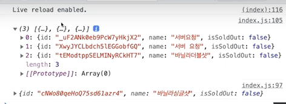
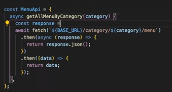

- [ ✔ ] 웹 서버를 띄운다.
- [  ] 서버에 새로운 메뉴가 추가될 수 있도록 요청한다. 
- [  ] 서버에 카테고리별 메뉴 리스트를 불러온다.
- [  ] 서버에 메뉴가 수정될 수 있도록 요청한다.
- [  ] 서버에 메뉴의 품절상태가 토글되 ㄹ수 있도록 요청한다. 
- [  ] 서버에 메뉴가 삭제 될 수 있도록 요청한다.

TODO 리펙터링 부분
- [  ] localStorage에 저장하는 로직은 지운다.
- [  ] fetch 비둘기 api를 사용하는 부분을 async await를 사용해 구현하다.

TODO 사용자 경험
- [  ] API 통신이 실패하는 경우에 대해 사용자가 할 수 있게 alert로 예외처리를 진행한다.
- [  ] 중복되는 메뉴는 추가할 수 없다. 

## 웹서버 시작하기
1. 저장소를 local에 clone해준다.
```
git clone https://github.com/blackcoffee-study/moonbucks-menu-server.git
```
터미널에 넣어주고,
해당 서버로 cd 해주고 다음 단계를 실행한다.

2. 저장소를 clone한 후 아래 명령어를 입력해 의존성 라이브러리를 설치해준다.
```
npm install
```

3. 아래 명령어를 이용해 서버를 동작시킨다.
```
npm start
```
---
## 웹 서버 요청으로 메뉴 생성하기
프런트 엔드에서 서버에게 요청을 할떄 필요한 것:   
<u>약속된 규칙이 필요함</u> -> 이거에 맞춰서 답변을 해줌
```js
fetch(`${BASE_URL}/category/${this.currentCategory}/menu`, {
    method: "POST",
    headers:{
        "Content-Type": "application/json",
    },
    body: JSON.stringify({name:menuName}),
}).then((response)=>{
    return response.json()
}).then((data)=>{
    console.log(data);
})
```

파라미터가 다음과 같다:
**fetch('url', option)**     
    
**option**: 서버에 데이터를 받는 것을 요청하는 것인지, 데이터의 삭제를 요청하는 것인지, 데이터의 생성을 요청하는 것인지 
이런 구체적인 약속의 내용이 포함됨

<u>method</u>:

* "`POST`"는 객체나 데이터가 새로 생기는 경우에 사용한다. 
* "`GET`"는 디폴트값이며, 

<u>headers</u>:

* Any headers you want to add to your request, contained within a Headers object or an object literal with String values. Note that some names are forbidden.
* 일반적으로 json데이터로 주고받는 경우가 대부분이라서
주고받는 콘텐츠 타입 (Content-Type)을 json으로 설정 => "application/json"

<u>body</u>: 

* Both requests and responses may contain body data. A body is an instance of either 
ArrayBuffer / TypedArray / DataView / Blob/File / String / URLSearchParams / FormData
* e. body: JSON.stringify({name:menuName})는 name이라는 key에 menuName값을 입력해서 서버에 요청한다. ***스트링 형태로 프런트-백 사이에 데이터 주고 받는다***

<u>mode</u>: 

* The mod you want to use for the request
* `cors`, `no-cors`, `same-origin`

<u>credentials</u>:

* Controls what browsers do with credentials (coookies, HTTP authentication entries, TLS client certificates)
* `omit`: Exclude credentials from request
* `same-origin`: Include credentials with requests to same-origin URLs. Use the credentials sent back in response (Default)
* `include`: Include credentials in both same- and cross- origin requests. Always use any credentials sent back


**url**: 주소. 어디로 "배달" 해야하는지 적혀져 있음
-> 나중에 서버 위치가 바뀔 수 있다 (숫자가 바뀜), 일일이 다 바꾸기에는 힘드니 처음부터 변수로 따로 저장하는 것이 좋다.

---     
## 전체 메뉴 불러오기

```js
fetch(`${BASE_URL}/category/${this.currentCategory}/menu`, {
    method: "POST",
    headers:{
        "Content-Type": "application/json",
    },
    body: JSON.stringify({name:menuName}),
}).then((response)=>{
    return response.json()
}).then((data)=>{
    console.log(data);
})
fetch(`${BASE_URL}/category/${this.currentCategory}/menu`)
.then((response)=> {
    return response.json();
}).then((data)=>{
    this.menu[this.currentCategory] = data;
    render();
    $("#menu-name").value = "";
})
```


보다시피 밑에 코드 (전체 메뉴를 불러와서 콘솔로그 하는 것)가 먼저 프로세스 됐다.
-> Javascript는 **single thread**이다.
한번에 한가지 일 밖에 못 한다.
(내가 시킨 녹차라떼 때문에 뒤에 사람들이 모두 못 주문하고 있음)

=> 진동벨을 주면 나도 기다릴 필요가 없고, 다른 사람들 주문도 바로바로 받을 수 있다.

**Promise**를 쓴다. 
⭐먼저 요청한 것에 대해서 답변을 먼저 못 받을 수 있음. 주문을 여러개 받았는데 뒤에 요청 한 것이 더 간단한 요청이면 뒤에것이 먼저 완료된다.

Promise는 비동기 통신인데, 이거를 통해서 프로세스가 완료되는 순서를 보장받을 수 있다. 


밑에 있는 코드를 설명하자면
```js
fetch(`${BASE_URL}/category/${this.currentCategory}/menu`)
.then((response)=> {
    return response.json();
}).then((data)=>{
    this.menu[this.currentCategory] = data;
    render();
    $("#menu-name").value = "";
})
```
1. 서버에 데이터를 요청해서 가져오고
2. .json()으로 스트링 파일을 오브젝트화 한다. 
3. this.menu[현재 화면에서 집중하고 있는 카테고리] = data로 서버 속 내용과 this.menu의 내용을 일치시킨다.
4. render()을 통해서 this.menu의 내용을 화면에 렌더 시킨다. (저번 시간에 만든 함수, map을 이용함)
5. 메뉴 이름 초기화하기


await를 하려면 항상 async가 필요하다
this.menu[this.currentCategory] = await MenuApi.getAllMenuByCategory(this.currentCategory);

지금 getAllMenuByCategory가 return값이 null 값이다. 

그래서 return값이 생기도록 조금 바꾸자
```js
const MenuApi = {
    async getAllMenuByCategory(category){
        const response = await fetch(`${BASE_URL}/category/${category}/menu`)
        return response.json();
    }
}
```
(init에도 쓰이고, addMenuName에도 쓰이는 녀석이라서 따로 만듦)

```js
async createMenu(name){
    await fetch('url',{
        //...
        body: JSON.stringify({name:name})
    })
}
```
name:name은 그냥 {name}으로 표현해도 JS가 알아듣는다. 

response.ok
-> 서버에서 잘 가져왔는지 확인해주는 코드

서버와 프런트 엔드의 도메인 속성값을 일치시키는 것이 매우 중요하다. 백엔드에서는 바뀌었는데 프런트에서는 안 바뀌면 문제가 된다. 

프런트는 서버에서 요청하기 전에, 사용자가 잘못된 요청을 하는 것을 미리 막아줘야한다.


if (!($("#menu-name").value in this.menu[this.currentCategory])){
            alert("이미 등록된 메뉴입니다. 다시 입력해주세요.");
            return
        }
const duplicatedItem = this.menu[this.currentCategory].find(menuItem => menuItem.name === $("#menu-name").value)

삼합연산자